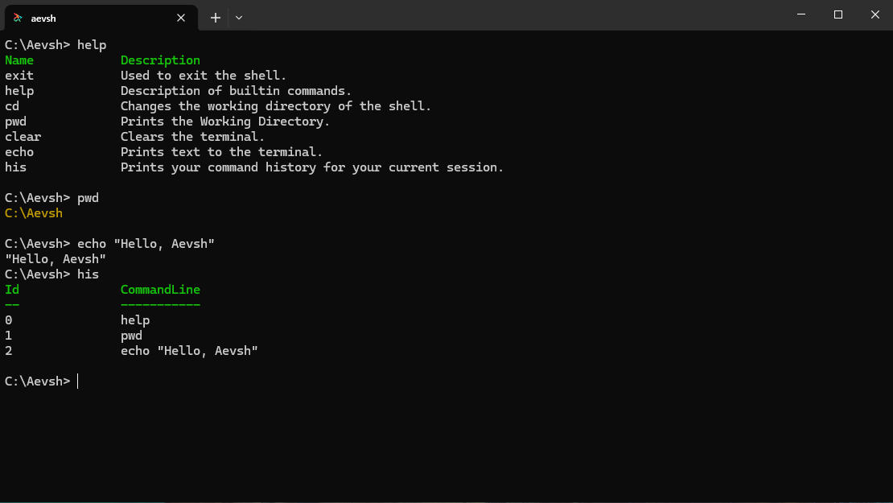

  
  
  <h1>Aevsh</h1>

  *A modern shell written in C*
  
  

> [!IMPORTANT]
> Aevsh is currently in active development. While you can execute simple external and built-in commands, the core shell implementation is still incomplete. It is not yet recommended for daily or production use.

## What is Aevsh?

Aevsh is a cross-platform shell inspired by the rich features of PowerShell and the user-friendly design of Fish. This is a personal hobby project currently in active development, meaning it is constantly growing and evolving. The long-term vision is to build a robust shell capable of handling complex tasks like advanced scripting, background job control, and command pipelines. However, because this is a learning project built from the ground up, these advanced features will be implemented one by one and may or may not be included in the final version. For now, the primary focus is to learn how operating systems work under the hood and getting the core shell basics running smoothly!

## Current status

At this point Aevsh can successfully handle the basic built-in commands like `cd`, `pwd`, `clear`, `echo`, `history` and `exit`. It can also execute simple external programs. It is a solid functional base that I am actively adding upon.

## Implementation tracker

### System & Execution
- [x] Basic shell loop
- [ ] Direct OS process creation
- [ ] PATH resolution
- [ ] Exit status tracking

### Built-in Commands
- [x] Navigation (`cd`, `pwd`)
- [x] Basic utilities (`clear`, `exit`, `help`)
- [ ] Directory management ('mkdir', 'rm' , and etc)
### Input Parsing
- [x] Quote handling (`""`, `''`)
- [ ] Escape sequences (`\`)

### Pipelines & Redirection
- [ ] Output redirection (`>`, `>>`)
- [ ] Input redirection (`<`)
- [ ] Piping (`|`)
- [ ] Multi-piping

### Job Control
- [ ] Signal handling (e.g., blocking Ctrl+C)
- [ ] Background execution (`&`)

### User Experience
- [x] Color highlighting in shell output
- [ ] Custom keystroke handling
- [x] Command history
- [ ] Syntax highlighting
- [ ] Auto-suggestions

### OS support
- [x] Windows
- [ ] Linux
